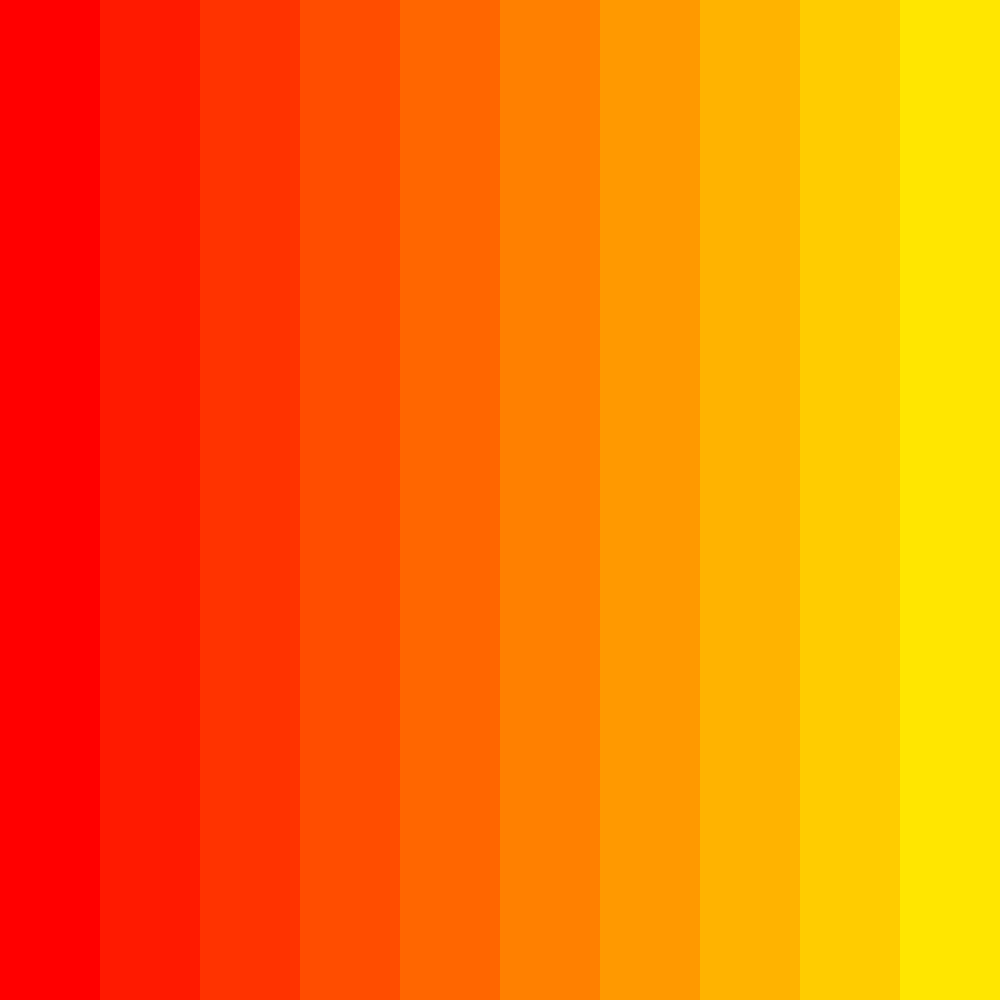
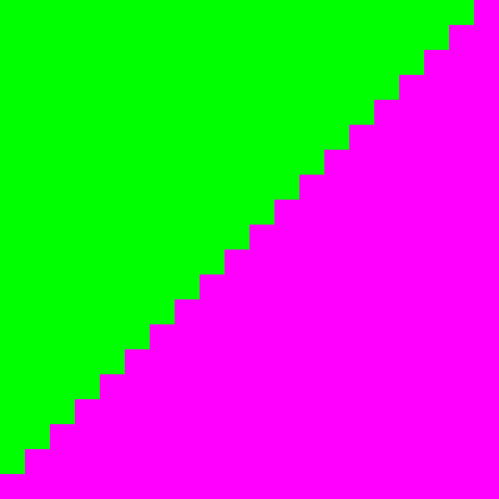
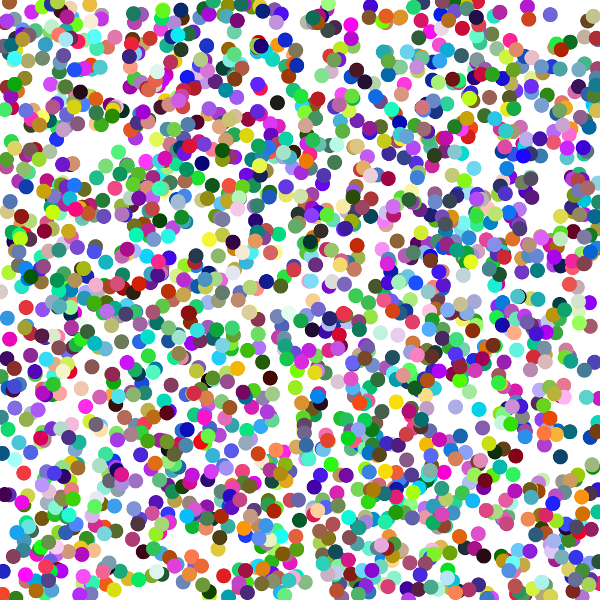
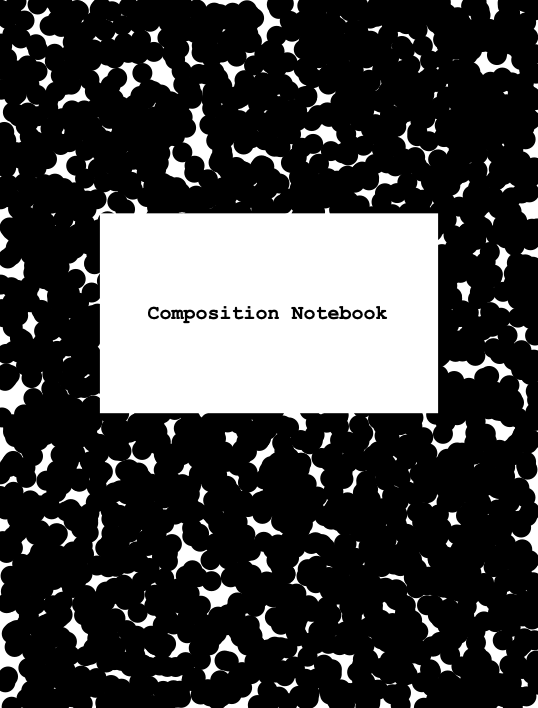

# Session 1 Challenges

Here are some challenges building on the things we started to learn this week …

## Donut

Use 'oval()' to draw a donut that fills the canvas. Can you make the size of the donut respond to arbitrary canvas sizes?

## Stripes

Create a row of rectangles that act like a gradient by changing the red, green, or blue values for the fill() (and not just defining them randomly!). You can do this by drawing each rectangle one at a time, or try drawing them all with a for-loop.

## Staircase

Draw a row of rectangles of increasing height to make a staircase. Again, you can do this by drawing one rect() at a time, or by drawing them all using a loop.

## Confetti

Use 'random()' along with 'width()' and 'height()' to draw shapes at random positions on the canvas.

## Composition notebook

Recreate the cover of a classic US student composition notebook with text() and randomly-drawn black circles.

